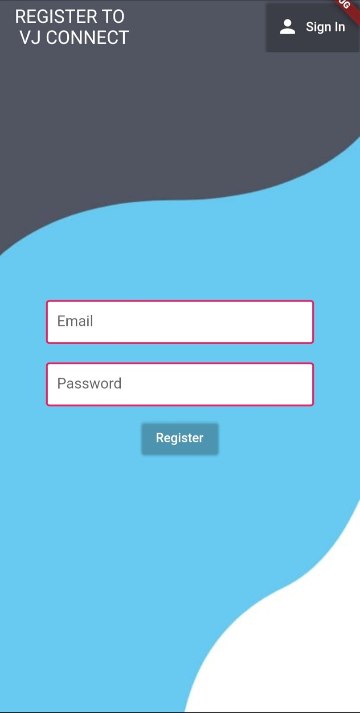
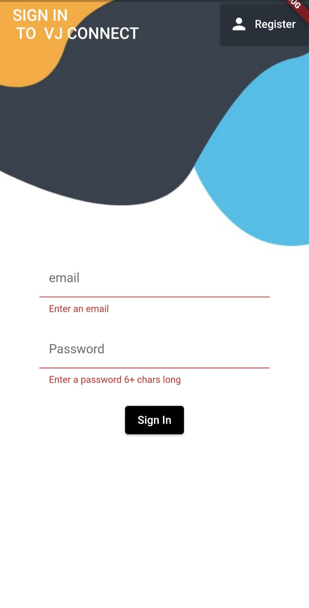
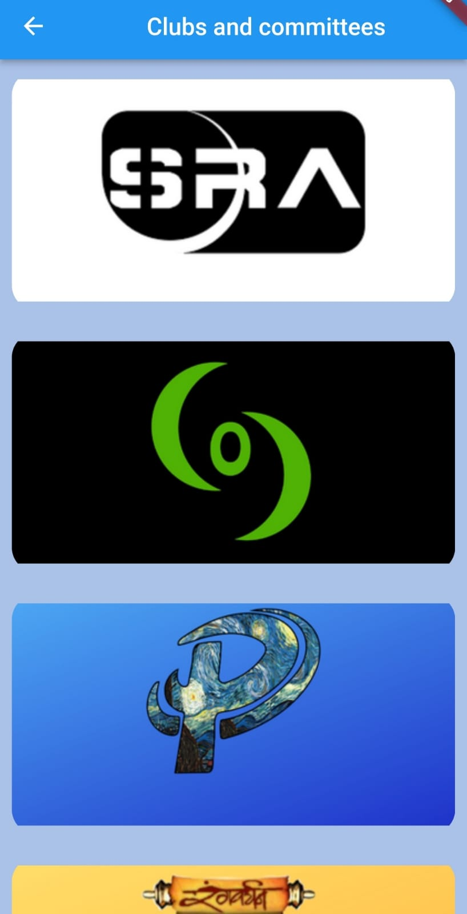
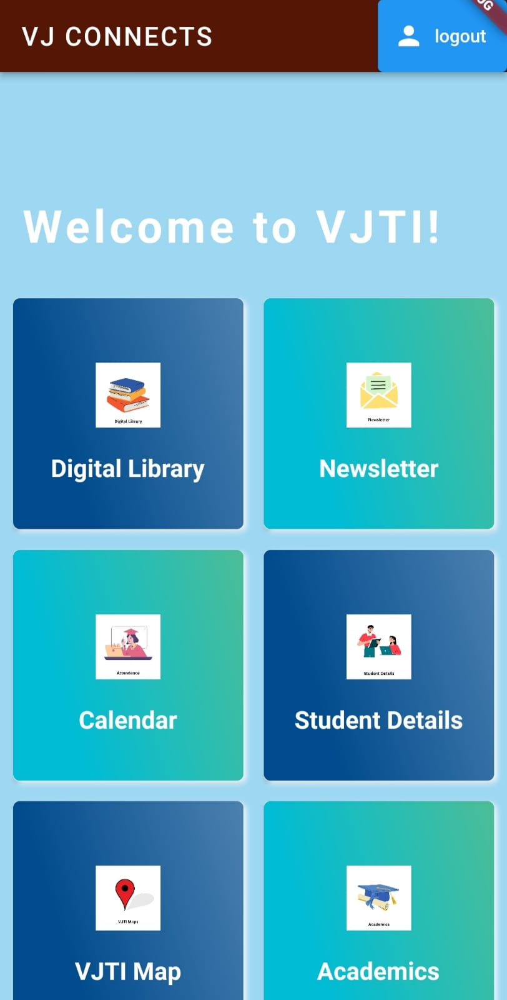
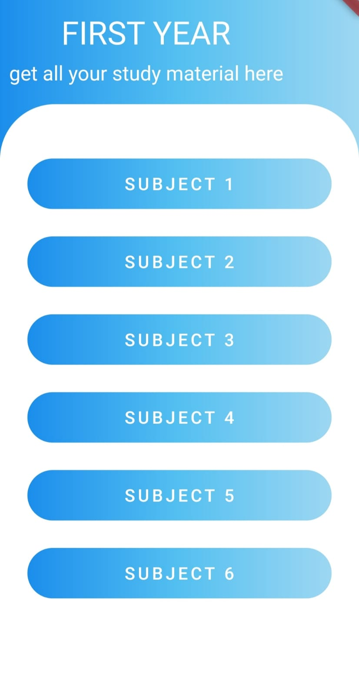
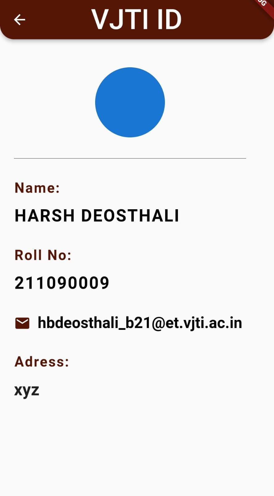
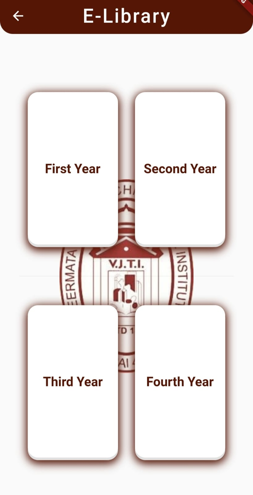

<h1 align="center">
  <a href="https://github.com/CommunityOfCoders/Inheritance-2022">
    
  </a>
  <br>
 VJConnect
</h1>

<div align="center">
   <strong>VJConnect</strong> - VJTI, MADE EASY!<br>
  CoC Inheritance 2022 || Team Marshmellows <br> <br>
</div>
<hr>

<details>
<summary>Table of Contents</summary>


- [Description](#description)
- [Links](#links)
- [Tech Stack](#tech-stack)
- [Progress](#progress)
- [Future Scope](#future-scope)
- [Applications](#applications)
- [Project Setup](#project-setup)
- [Usage](#usage)
- [Team Members](#team-members)
- [Mentors](#mentors)
- [Screenshots](#screenshots)

</details>

## 📝Description

VJConnect: VJTI MADE EASY! 
We designed this app with the aim of simplifying the hectic student life and giving them the tech support they’ve always deserved and needed. 
The VJConnect is one stop solutions for all the needs of the VJTIans. Be it organised academic records, or the plethora of study material on the digital library, be it the campus map to help you navigate using your finger-tips, the calendar to schedule everything, or the in depth student details, be it the attendance or the news from throughout the campus, WE’VE GOT YOU COVERED! 
Hope you enjoy using our app that we’ve made with all our heart and do look forward to all the exciting features to come!<br>
<br>
List of features you can take advantage of:
1. Student Details
2. Digital Library
3. Campus Map
4. Organised Academic Records
5. Newsletter-all clubs and comittee info and links

## 🔗Links

- [GitHub Repository](https://github.com/rajatkaush11/VJTI_APP)
- [Demo Video]()
- [Drive Link to Screenshots of your project]()
- [App APK Link]()
- [Hosted Backend Link]()


## 🤖Tech-Stack
- Flutter


#### LANGUAGE
- DART


#### Database
- Flutter Database


## 📈Progress

List of all the fully implemented features in our VJ CONNECT aplication:-

- [x] Newsletter
- [x] Calendar
- [x] Campus Map
- [x] Student Details

List of all the partially implemented features in our project:-

- [ ] Attendance 
- [ ] Academic Record


## 🔮Future Scope

List down all the future plans for the project here

- Attendance feature using QR codes.
- Floor wise Map for respective department buildling.
- Announcement of workshops of various clubs and committee.
- Database organization and access for the faculty.

## 💸Applications

1. Academic Records
Academic records are vital for any student as they are extremely valuable for everything ranging from an upcoming exam to future prospects such as masters. Collecting all this important data in one place is very useful and convenient.
```
2. VJTI Maps
```
Navigating through the campus is not easy! Even the well-accustomed students need maps to reach their on-campus destination; this is where our maps come into play, they’re convenient to use, zoomable, and at your fingertips. 
```
3. Calendar
```
As scheduling has become crucial in today’s busy world, a student must have a calendar handy to track all the academic and extra-curricular events coming up on campus.
```
4. Newsletter
```
Many-a-times, word of mouth isn’t enough to let everyone know about the events that are supposed to take place on campus. As everyone has a smartphone accessible, they can do this using just a single app. Because, what is college life without the events and their updates!
```
5. E-Library 
```

## 🛠Project Setup

1. We suggest starting by installing Android Studio, as that's where we've developed our app.
2.  git clone from [GitHub Repository](#Github-Repository), make sure you get all the assets and the project files successfully cloned to your machine.

Now you are ready to run the program in Android studio.
## 💻Usage
-----
Open the files in Android Studio.
-----
Now there are three ways to run our application:
1.Select an emulator and run it on Android Studio.
You  use VJConnect application on your device by:
1. By enabling Developer mode, then by using wifi and scanning the QR code from Android Studio.
2. You can also do this by enabling Developer mode in your deivce and connecting a USB cable and then selecting your device as emulator. 
3. Once done, navigate through the pages and use the app as per your need.

## 👨‍💻Team Members

The team members with their emails and links to their GitHub accounts:

- [RAJAT KAUSHIK](https://github.com/rajatkaush11)<br> Email:
 rrkaushik_b21@et.vjti.ac.in 
- [MAHIMA TRIPATHI](https://github.com/)<br>
 Email: mstripati_b21@et.vjti.ac.in
 - [HARSH DEOSTALI ](https://github.com/rajatkaush11)<br> Email: hbdeosthali_b21@et.vjti.ac.in 
- [SAKSHI SINGH](https://github.com/)<br>
 Email: ssingh_b21@et.vjti.ac.in


## 👨‍🏫Mentors

Our mentors with their emails and links to their GitHub accounts:

- [Amogh](https://github.com/): Email 
- [Ritika](https://github.com/): Email 

## 📱Screenshots
<br>








